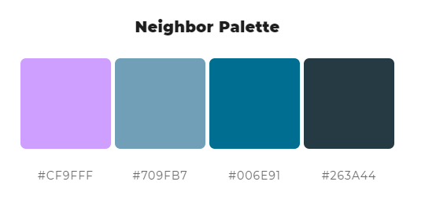
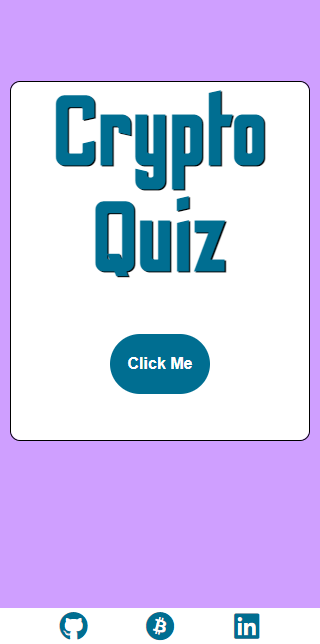

# Crypto Quiz

[Link to Quiz Website Here](https://riyadhkh4n.github.io/crypto-quiz/)

Crypto Quiz is a Javascript web application that is aimed at anyone who wishes to put their crypto knowledge to the test. This quiz is designed to test your knowledge and the questions are based from [Cryptools](https://riyadhkh4n.github.io/cryptools/), so having a read will give you all the infromation you need to pass the quiz. Questions and answer options will be produced on the screen one after the other in a randomised order, where the user will be given up to ten question. The user will then select the correct option or the option they think is correct, where their score will be logged letting them know how they did until they have answered all the questions. Once finished they will be met with a results screen allowing them to see how well they did and give them the option to play again or quit. 

---
IMAGE FROM AMIRESPONSIVE HERE
---


# User Experience (UX) ~

* ## Vision
   Crypto Quiz is a game which aims to test your knowledge about the world of cryptocurrencies and to engage people who want to learn and get into the space, whether you are a complete beginner or want to expand what you already know. This game will take you through the core concepts of cryptocurrencies and and test everything you have learnt. As someone who is invested in crypto and really believes in the technology behind it, I would have loved to have an interactive game where I could have tested my knowledge so I am doing just that and creating it myself. I want this game to be inclusive and accessible for everyone, I want it to be engaging and to encourage the you into getting involved in the space.

* ## Aims
   To give provide a platform for crypto newbies or experts to test what they know in an all in one game, and to allow them to quickly learn the core concepts of this complex industry giving them the opportunity to make smarter investment decisions, in a fun and interactive way. I want the game to be fun and have re-play value so I will make the questions random each time so you can play and get tested on different aspects of the industry. 

* ## Target Audience
    There are a number of target audiences for this game due to the fact that crypto is for everyone. We welcome new and experienced people from ages, to come and learn adn test their knowledge about this fascinating industry. However, Crypto Quiz is mainly aimed at educating people who know nothing about crypto as it the questions will not be extremly diffuclt and just touch on the main aspects of the indusrty. 

* ## User Stories
    * #### First Time Visitor Goals:
        a. As a First Time Visitor, I want to be able to set a new score when playing the quiz.
        b. As a First Time Visitor, I want to see how many questions I got right and wrong.
        c. As a First Time Visitor, once the game is finished I want to be able to play again.

    * #### Returning Visitor Goals:
       a. As a Returning Visitor, I want to be able to play Crypto Quiz and have the same experience as the first time.
       b. As a Returning Visitor, I want to see new questions when I play.
       c. I want to be able to see my previous scores.

    * #### Frequent Visitor Goals:
       a. As a Frequent Visitor, I want to see if any new questions have been added to the game.
       b. As a Frequent Visitor, I want to see if I can beat my old score.

* ## Design ~

    * Colour Scheme:

        The three main colours for Cryptools are #CF9FFF, #006E91 and #263A44. This colour palette was generated for me by using ColorSpace and selecting their Dotting Palette, of course black and white are prominent colours in the game aswell and are used interchangeably. I tried to stay as consistent as possible however depending on the part of the game the user is on the main colour changes. I chose these colours because my favourite colour is purple so I used it for the background, I then wanted to use colours that compliment #CF9FFF and not clash with it, which is where ColorSpace came in handy.

        

    * Typography:

        The font I have decided to use for the questions of the game is [Odibee Sans](https://fonts.google.com/specimen/Odibee+Sans?query=Odibee) as this is a retro game looking font which is eye - catching and I think fit the game well. For the answers to the questions and any other infromation I will use [Roboto Condensed](https://fonts.google.com/specimen/Roboto+Condensed?query=Roboto+Condensed) as it is a more readable font as contrasts nicely with the main font for the website. An example of how they look together is below:

        

    * Imagery & Videos:

        For Crypto Quiz there will be no videos linked as it is not necessary however I may add a few crypto related images throughout the game or in the background where I see fit.

    * Icons:
    
        I decided to use the [Font Awesome](https://fontawesome.com/start) icons. The icons that I chose fit in well with the overall theme of cryptocurrencies. The icons are styled in accordance with my website, with the same colors and font size.

* ## Scope ~

    * When creating Crypto Quiz I will take a waterfall approach when developing. That is, creating sections of the website at a time and ensuring they work as intended before going onto the next section. I will be able to break up development by choosing small elements to work on daily, ensuring the website can be built and published in a timely fashion. As this porject incorporates JavaScript a large majoirty of my time will be spend developing and testing the logic behind the game as opposed to the aesthetics of the game as it will have a fairly simple design. 

* ## Structure ~

    * I have chosen to create the game with a single html page which will have multiple sections which the user will see when playing the game, once they move onto the next part of the game the prvious sections will be hidden from view and the new section will be displayed to them. The game will not have a navigation bar at the top as I want the user to follow a set path when navigating the wesbite.

    * On the 'index.html page', I will have multiple divs which will contain each section of the game, for example, the 'Start Section' which is the first thing that will load when they open the game. The next section will be the 'Rules Section' which will explain the rules of the quiz and give them the option to either quit or continue. The section after this will be the actual game e.g. 'Quiz Section', this is where the questions and answers will be presented to them, as well as this where their scores will be present. Once the game is complete, they will be met with the 'Results Section' which will show them their score and give the user the option to exit or play again. As mentioned before, once the user progresses to the next section all previous sections will be hidden to them.

* ## Wireframes

    * I made some basic wireframes using Balsamiq at the beginning of the project, this allowed me to get a brief understadning of how I want Crypto Quiz to look as well as ensuring I have a rough model to follow. I found Balsamiq very helpful and easy to use, I didn't quite know what styling I wanted on my pages however I had a rough idea how I wanted the quiz to look. I knew how many pages I wanted my website to have and how the sections should link to one another. Balsamiq allowed me to create a visual of my idea and gave me a goal to work towards, below my wireframes.

    * ### Landing Page Wireframe

    


    * ### Instructions Page Wireframe

    

    * ### Quiz Page Wireframe

    

    * ### Results Page Wireframe

    


# Features ~

Here describes the main features of the website and what the user can expect when viewing ~

## Existing Features:

* ### Landing Screen

    * This is the first thing the player will see when the launch the website. They will be met with a flip card which when they hover over will dipslay the rules for the game. Or for mobile users, they will click the card which would then cause the card to flip over.

    * Once the card has flipped over, the user will be able to click the 'Continue' button. If selected, this will cause the card to disapear and the quiz section of the game to appear for the users to begin playing. 

    
     

* ### Quiz Interface

    * Here is the actual game part of the website. This is where the players will interact with and where all the questions and answers will be displayed for them to try and guess. It is made up of a header, main area and a footer. 

    * The header holds the name for the quiz as well as a section which will count how long the user has been playing the quiz for. This time as well as their score will be saved to local storage and imputted into a score board where they can keep track of their previous attempts and try and beat old high scores.

    * The main area is where the question will be displayed, as well as four buttons which will hold the possible answers to the questions. The user will have one chance to answer the question and hopefully make the right choice, if they do make the correct choice then their selection highlight in green, else their selection will go red and the correct answer will be highlighted in green.

    * The footer section holds the question count as well as the 'Next' button which will be made visible to the user once a selection has been made. The question count will iterate as they move through the questions until they reach to the final question which will be number 10. Where at that point the quiz section will be hidden from the user and the results box will be displayed.

    
    

* ### Results Page

    * This is the final section of the game that the player will interact with. Once they have completed the quiz this screen will appear showing them their score as well as the time taken to complete the quiz. Once the user has played a couple games, their previous scores and times will be displayed in the score board for them to see.

    * The user will also be met with three buttons which they can interact with, a 'Clear Board' button which when clicked will wipe the leaderboard of all old times and scores. The 'Replay Quiz' button which will reload the game so they are back at question one and can play through the quiz again. Finally, the 'Quit Quiz' button which will reload the whole website so they are met with the landing screen again.

     * INSERT IMAGE ONCE STYLED *


## Features Left to Implement:

# Technologies ~

## Languages Used

- [HTML5](https://en.wikipedia.org/wiki/HTML5)
- [CSS3](https://en.wikipedia.org/wiki/CSS)
- [JavaScript](https://en.wikipedia.org/wiki/JavaScript)

## Frameworks, Libraries & Programs Used:

1. [GitPod](https://www.gitpod.io/):
    * GitPod was the IDE used to create the site

2. [Google Fonts](https://fonts.google.com/):
    * Google fonts were used to import the 'Shrikhand', 'Work Sans' and 'Space Mono' font into the style.css file which is used on all pages throughout the project.

3. [Font Awesome](https://fontawesome.com/):
    * Font Awesome was used on all pages throughout the website to add icons for aesthetic and UX purposes.

4. [Git](https://git-scm.com/):
    * Git was used for version control by utilizing the Gitpod terminal to commit to Git and Push to GitHub.

5. [GitHub](https://github.com/):
    * GitHub is used to store the projects code after being pushed from Git. It was also used to deploy the project (GitHub Pages)

6. [Flexbox](https://css-tricks.com/snippets/css/a-guide-to-flexbox/):
    * Flexbox was used to help with the layout and responsivness of the webpage

7. [Balsamiq](https://balsamiq.com/):
    * Balsamiq was used to create the wireframes during the design process.

8. [TinyPNG](https://tinypng.com/):
    * This was used to compress all images used in the website as well as the README.md

9. [ColourSpace](https://mycolor.space/):
    * This was used to chose the colour palette for the website

10. [Autoprefixer](https://autoprefixer.github.io/):
    * It allowed me to write your CSS rules without vendor prefixes, it takes care of doing that based on current browser popularity and property support.


# Testing ~

## Initial Testing

* The website was tested on Google Chrome, Microsoft Edge, Brave browsers as well as Safari.
* The website was viewed on a variety of devices such as Desktop, Laptop, iPhone7, iPhone 8 & iPhone 11.
* Testing was completed to ensure that all pages were linking correctly from the navigation bar and footer.
* Friends and family members were asked to review the site and documentation to point out any bugs and/or user experience issues.

The W3C Markup Validator and W3C CSS Validator Services were used to validate every page of the project to ensure there were no syntax errors in the project.

- [W3C Markup Validator](https://validator.w3.org/#validate_by_input)


- [W3C CSS Validator](https://jigsaw.w3.org/css-validator/)


- Validated JavaScript using [JSHint](https://jshint.com/)

## Website Testing (Solving Issues):
---


##  Browser Compatibility & Responsivness
---

The output of Crypto Quiz when being viewed on Microsoft Edge can be seen below:


The output of Crypto Quiz when being viewed on Brave Browser can be seen below:


The output of Crypto Quiz when being viewed on Firefox can be seen below:


Crypto Quiz when being viewed at 1600px:


Crypto Quiz when being viewed at 1440px:


Crypto Quiz when being viewed at 1024px: 


Crypto Quiz when being viewed at 768px:


Crypto Quiz when being viewed at mobile (425px):


## Testing User Stories from User Experience (UX) Section

* ### First Time Visitor Goals:
    
* ### Returning Visitor Goals:
   
* ### Frequent User Goals:
   
## Bugs

# Deployment ~

## GitHub Pages

The project was deployed to GitHub Pages using the following steps...

1. Log in to GitHub and locate the GitHub Repository

2. At the top of the Repository (not top of page), locate the "Settings" Button on the menu.
    
3. Scroll down the Settings page until you locate the "GitHub Pages" Section.
    Under "Source", click the dropdown called "None" and select "Master Branch".
   
4. The page will automatically refresh.
    
5. Scroll back down through the page to locate the now published site link in the "GitHub Pages" section.

## Forking the GitHub Repository

By forking the GitHub Repository we make a copy of the original repository on our GitHub account to view and/or make changes without affecting the original repository by using the following steps...

1. Log in to GitHub and locate the GitHub Repository
2. At the top of the Repository (not top of page) just above the "Settings" Button on the menu, locate the "Fork" Button.
3. You should now have a copy of the original repository in your GitHub account.


## Making a Local Clone

1. Log in to GitHub and locate the GitHub Repository
2. Under the repository name, click "Clone or download".
3. To clone the repository using HTTPS, under "Clone with HTTPS", copy the link.
4. Open Git Bash
5. Change the current working directory to the location where you want the cloned directory to be made.
6. Type git clone, and then paste the URL you copied in Step 3.

    $ `git clone https://github.com/RiyadhKh4n/crypto-quiz.git` 

7. Press Enter. Your local clone will be created. 

```
$ git clone https://github.com/RiyadhKh4n/crypto-quiz
> Cloning into `CI-Clone`...
> remote: Counting objects: 10, done.
> remote: Compressing objects: 100% (8/8), done.
> remove: Total 10 (delta 1), reused 10 (delta 1)
> Unpacking objects: 100% (10/10), done.
```

# Credits ~

## Content:
* All information on the website was taken from different souces as well as a large marjority being my own - Links to all sources are below:

## Media

### Images

## Code
 
---
