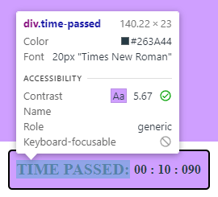

The first problem I had to solve on the JavaScript side, was that I needed to randomly generate 10 questions for the user to go through from my question bank. In order to do this, I had to first create my questions which contain the question itself, the correct answer as well as a list of four potential answers.

An output of some of the questions from the question bank is below: 


Now that I have created a question bank, I have to then randomly select and store 10 questions from the total question bank which the users will answer. To do this I have created a function called displayQuestions() which holds the necessary code needed to generate and display the questions.

```
function displayQuestions(index){
    const questions_to_user = document.querySelector(".questions"); //store the question in var
    const choices = document.querySelectorAll(".option"); //store the for options in the var choices

    for(let i = 0; i < 10; i++){
        let game_question = {};
        let generateQ = questions[Math.floor(Math.random() * questions.length)];
        console.log(generateQ);
    } 
}
```

The main part of the function is the for loop which iterates 10 times, this is because I only want 10 questions to be displayed to the user. A variable called generateQ is created which stores the randomly selected questions from the question bank shown above. It uses Math.floor() and Math.random() which is needed in order to randomly select an element from my array. I then console.log() in order to test if I have correctly generated the questions.

An output of the selected questions is below: 


As you can see above, there are 10 questions which are selected and each time the program is run a different set of questions is selected meaning I have succesfully solved my problem. The next step is to then extract each element i.e question and answers and then display them in the html of the webpage.

---

The next issue I faced when developing Crypto Quiz was that I knew I wanted to implement a timer function which would start once the user begins the quiz, and then end once the user has answered the last question. Their time paired with their score would then be saved to local storage and displayed on a leaderbaord which could be seen at the end. 

To begin with I created and styled the section which would display how long they have been doing the quiz to the user:


Once it was styled I writting the functionality to which would allow the timer to start once the relevant buttons had been selected. I knew that there were two instances where I wanted the timer to begin; when they begin the quiz and if they decide to replay the quiz. The relevant buttons are displayed below: 


So, when the 'Continue' button and 'Replay Quiz' button are selected I want the timer to begin counting up.

I began by adding an EventListener to the relevant button which can be seen below:

```
start_btn.addEventListener('click', ()=>{
    int = setInterval(startTimer, 10);
});

replay_quiz.addEventListener('click', ()=>{
    int = setInterval(startTimer, 10);
});
```

The following code will listen out for the button to be interacted with by the user, hence the 'click' will call the EventListener. If either buttons are clicked then the variable int which was delcared at the beginning of the file will be passed the setInterval method which itself contains the starTimer method which will contain all the code which is responsible for the clock functionality. 

The setInterval() method in JavaScript is used to repeat a specified function at every given time-interval. It evaluates an expression or calls a function at given intervals. This method continues the calling of function until the window is closed or the clearInterval() method is called.

The startTimer() method is displayed below:

```
let [milliseconds, seconds, minutes] = [0,0,0];
let int;
```

```
 function startTimer(){
    milliseconds += 10;
    if(milliseconds == 1000){
        milliseconds = 0;
        seconds ++;
        if(seconds == 60){
            seconds = 0;
            minutes++;
            if(minutes == 60){
                minutes = 0;
            }
        }
    }

    let m = minutes < 10 ? "0" + minutes : minutes;
    let s = seconds < 10 ? "0" + seconds : seconds;
    let ms = milliseconds < 10 ? "00" + milliseconds : milliseconds < 100 ? "0" + milliseconds : milliseconds; 

    timerRef.innerHTML = `${m} : ${s} : ${ms}`;
}
```
The first two lines of code create a variable which contains the relavant time intervants ie. ms, s and m and sets them all to zero. I then create another variable called int which is not initalised.

The function doesnt take any parameters as it is not needed. The function starts with miliseconds (ms) and increases its value by 10. If the value of ms equals 1000 which is the same as 1 second then it should reset its value and then increase the seconds. This same logic continues but instead of 1000 seconds its 60 as there are 60 seconds in 1 minute. 

Then three more variables are created against the respected time intervals I have chosen, and if else statements are created for each which will change their value depending if they meet the condition of being less than 10.

Finally, I change the html by accessing the the timerRef variable:

```
let timerRef = document.querySelector('.timer-sec');
```

This will cause the time to actually change in real time when the user selected one of the buttons mentioned earlier. A working view of the timer can be seen below:


---

When testing accessibility contrast of the game I made ensured that all scores where above 5, and output of the test are below:


When assessing the accessibility score of the answer buttons they score under 5 due to the colour contrasting so I changed the background of the buttons in order to improve the score.

]

By changing the background-color to #006E91 I was able to get the score to 5.77 which meant it passed the accessibility test


I still wanted to have the buttons to have a :hover affect with the background-color being #CF9FFF so in order to do this I also changed the font color to be #263A44 allowing me to get an accessibility score of 5.67


```
button[id^=ans].option:hover{
   background: #CF9FFF;
   color: #263a44;
}
```

I had to change the colour of the timer text as this was giving be a score below 3, therefore I changed the font colour to #263a44 in order to get my score back above 5.



When checking the results page several elements failed the accessibility test so I played with the colours of the background and font in order to get the best score possible


--- 
A problem I was having with my code was that my generateQuestions() and showQuestions(questionBank) functions were not working as intended. generateQuestions() takes in no parameters and its purpose is to randomly chose 10 questions from questions.js that will display to the user. I was able to get the questions generating fine but it is when I passed the questions which were held in RandomQuestions to showQuestions(questionBank) were the error occured, it would not let me access the individual elements of each question in questions.js. After several hours of debugging and getting help from Tutor Support I realised the error was occuring because although I was generating the questions I was not pushing them to the array correctly.

In order to fix the problem I declared an array called randomQuestionArray and set its contents to empty

```
let randomQuestionArray = [];
```

I then created a variable called RandomQuestions which would store the 10 randomly selected questions from questions[]

```
 let RandomQuestions = questions[Math.floor(Math.random() * questions.length)];
```

Within the for loop which ran 10 times, I would push the contents of RandomQuestions to randomQuestionArray allowing me to have the questions in an indexed way which I could access later on.

```
randomQuestionArray.push(RandomQuestions); 
```

As a test I console.log(randomQuestionArray) and ran the program twice to see if questions would generate and be different each time, the output is below:


As you can see I now have questions randomly generating each time the program is run which I can now access via index. This now meant when I wanted to call the function I could pass in que_count which is a varibale which increments as the user moves through the game allowing them to see the correct question and interact with the game as intended.

```
showQuestions(randomQuestionArray[que_count]);
```

However, the problems did not stop there. After running the game several times I found that sometimes 20 questions would generate and this would happen when the user selected either the 'Replay' or 'Quit' buttons at the end of the game. This was due to my exitGame() and resetGame() functions calling startGame() meaning a new batch of questions would be generated before the old batch were removed. In order to fix this issue, I changed how the functions worked ensuring I cleared the randomQuestionArray before new questions were generated.

The updated and working funcitons are displayed below:

```
function resetGame() {
    resultBox.classList.add("hidden"); 
    quizBox.classList.remove("hidden"); 
    next_btn.classList.add("hidden");

    const options = document.querySelectorAll(".option_list");
    const allOptions = options.length; //getting all option items

    for (i = 0; i < allOptions; i++) {
        options[i].classList.remove("disabled"); //once user select an option then disabled all options
    }

    int = setInterval(startTimer, 10);
    randomQuestionArray = []; //clears array
    initialseVariables(); //resets variable values
    startGame(); // called generateQuestions()
    showQuestions(randomQuestionArray[que_count]);  
}
```

```
function exitGame() {
    resultBox.classList.add("hidden"); 
    flipcard.classList.remove("hidden"); 

    const options = document.querySelectorAll(".option_list");
    const allOptions = options.length; //getting all option items

    for (i = 0; i < allOptions; i++) {
        options[i].classList.remove("disabled"); //once user select an option then disabled all options
    }

    randomQuestionArray = [];
    initialseVariables();
}
```